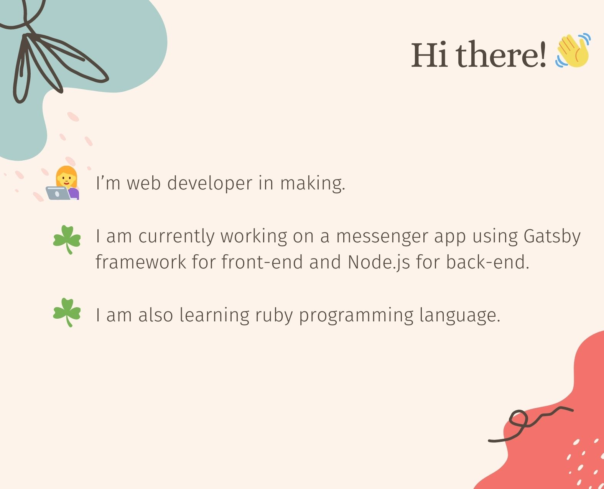

<!-- ### Hi there 👋

- 🌱 I’m self taught front-end web developer.
- 🔭 I am currently working on a messenger app using Gatsby framework for front-end and Nodejs for back-end.
- 🔭 I am also learning ruby programming language. -->

Total Commits - 335 in 2021

<!--
**inverseswirl/inverseswirl** is a ✨ _special_ ✨ repository because its `README.md` (this file) appears on your GitHub profile.

- 👯 I’m looking to collaborate on ...
- 🤔 I’m looking for help with ...
- 💬 Ask me about ...
- 📫 How to reach me: ...
- 😄 Pronouns: ...
- ⚡ Fun fact: ...
-->
